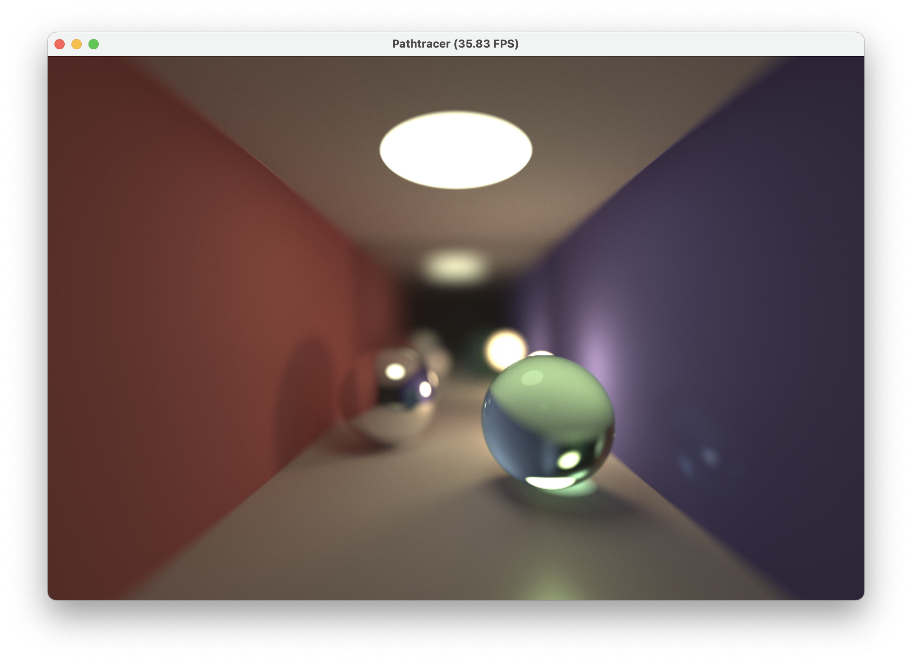

# Taichi Small Path Tracer

A small path tracer implemented using Taichi-lang.



## What's Implemented

- Support for diffuse, specular, and refractive materials
- Adjustable surface roughness
- Configurable camera with depth of field effects
- Sub-pixel sampling
- Russian Roulette path termination
- Gamma correction

## Requirements

- Python 3.9
- Taichi 1.7.1

## Usage

Run the path tracer using:

```
python smallpt.py
```

The renderer will open a GUI window showing the progressive rendering of the scene. The image will continue to refine over time as more samples are collected.

## Customization

You can modify various aspects of the renderer:

- Adjust `RESOLUTION` to change the output image size
- Modify `N_SUBPIXEL` to control the number of samples per pixel
- Adjust `MAX_DEPTH` to change the maximum ray bounce depth
- Modify the `Camera` parameters in the `main()` function to change the view
- Edit the `init_scene()` function to create custom scenes with different spheres and materials

## License

This project is open source and available under the [MIT License](LICENSE).

## Acknowledgements

- [Taichi Graphics](https://taichi.graphics/)
- [Physically Based Rendering](http://www.pbr-book.org/)
- [smallpt: Global Illumination in 99 lines of C++](https://www.kevinbeason.com/smallpt/)